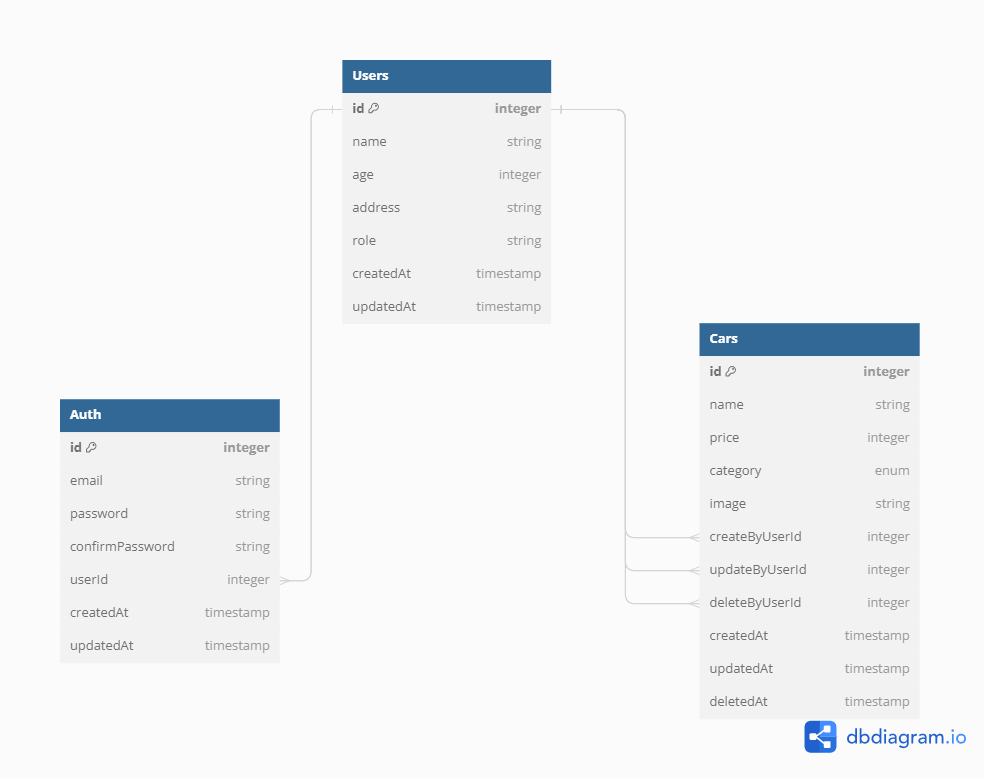

# Step

1. npm Install
2. buat file .env, copy env variable dari .env.example
3. npm run dev

# Login Super Admin

-   email: admin@mail.com
-   password: admin\*nirwan

# Diagram

# Page link

PORT : localhost:9000

API Docs : http://localhost:9000/api-docs

END POINT AUTH

-   Super Admin Login: /api/v1/auth/superadmin/login
-   Admin Login: /api/v1/auth/admin/login
-   member Login: /api/v1/auth/member/login
-   Check Me : /api/v1/auth/me
-   Admin Register : /api/v1/auth/admin/register
-   Member Register : /api/v1/auth/member/register

END POINT CARS

-   Creat New Data: /api/v1/cars
-   Find All Data: /api/v1/cars
-   Find By Id: /api/v1/cars/:id
-   Update : /api/v1/cars/:id
-   Delete: /api/v1/cars/:id

END POINT USERS

-   Get All Data : /api/v1
-   Get Data By Id : /api/v1/users/:id
-   Update Admin : /api/v1/users/admin/:id
-   Delete Admin: /api/v1/users/admin/:id
-   Delete Member: /api/v1/users/member/:id
-   Delete Member: /api/v1/users/member/:id
